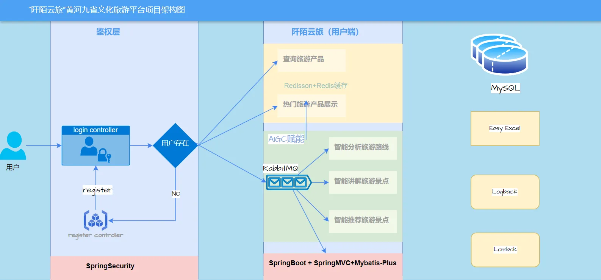

# “阡陌云旅”黄河九省文化旅游平台

## 项目背景

**“阡陌云旅”黄河九省文化旅游平台**

“阡陌云旅” 黄河九省文化旅游平台是一个专注于黄河流域九省文化旅游资源整合与推广的项目。

黄河是中华民族的母亲河，黄河流域拥有丰富的历史文化遗产和自然景观资源。然而，由于地域广阔、资源分散，黄河九省的文化旅游资源未能得到充分整合和推广。“阡陌云旅” 黄河九省文化旅游平台的出现，旨在解决这一问题，通过整合资源、创新服务，提升黄河流域文化旅游的整体竞争力。

## 项目演示

## 项目架构图

## 技术选型

### 后端技术选型

1. **JAVA 版本**：

- JDK11 是一个较为成熟的 Java 版本，具有良好的性能和稳定性，提供了丰富的新特性和改进，为项目的开发提供了强大的基础支持。

1. **后端框架**：

- Spring Boot 2.7.1：简化了 Spring 应用的开发，提供了自动配置、快速启动等功能，大大提高了开发效率。
- SpringMVC：作为经典的 Web 开发框架，负责处理请求和响应，实现了清晰的 MVC（Model-View-Controller）架构，易于维护和扩展。
- Mybatis-Plus 3.5.0：增强了 MyBatis 的功能，提供了通用的 CRUD（Create、Read、Update、Delete）操作、分页插件等，减少了开发工作量。

1. **缓存数据库**：

- Redisson+Redis：Redis 是一种高性能的内存数据库，可用于缓存热点数据，提高数据访问速度。Redisson 是 Redis 的 Java 客户端，提供了丰富的分布式数据结构和功能，方便进行分布式缓存的管理。

1. **数据库**：

- Mysql5.7：广泛应用的关系型数据库，具有稳定的性能和丰富的功能。Navicat 是一款数据库管理工具，方便进行数据库的管理和操作。

1. **分布式消息队列**：

- RabbitMQ：可靠的分布式消息队列，用于实现异步通信、解耦系统组件，提高系统的可扩展性和性能。

1. **权限控制**：

- Spring Security：提供了强大的安全认证和授权功能，确保系统的安全性，防止未经授权的访问。

1. **工具类**：

- 发邮件工具类：可以用于发送通知邮件，如用户注册成功、密码重置等。
- 生成验证码工具类：增强用户登录的安全性。
- 线程池：提高系统的并发处理能力，避免频繁创建和销毁线程带来的开销。
- Easy Excel：方便进行 Excel 文件的导入和导出操作。
- Lombok：减少 Java 代码中的样板代码，提高开发效率。
- Ajax：实现异步数据交互，提升用户体验。
- Logback：强大的日志框架，方便进行日志记录和管理，有助于系统的调试和故障排查。

### 前端技术选型

1. **前端框架**：

- React：流行的前端 JavaScript 库，具有高效的渲染性能和良好的组件化开发模式，方便构建复杂的用户界面。
- AdminLTE2：提供了美观的后台管理界面模板，加快了前端开发速度。
- Umi OpenAPI：可能用于方便地与后端 API 进行交互和管理。

1. **模板引擎**：

- Ant Design Pro：基于 React 的企业级中后台前端解决方案，提供了丰富的 UI 组件和功能，提高了前端开发效率和用户体验。
- Thymeleaf：服务器端模板引擎，可用于生成动态的 HTML 页面，与后端框架结合紧密。
- Echarts：强大的数据可视化库，用于展示数据分析结果和图表。

### 人工智能能力

- AIGC（可用国内外大模型）：引入人工智能生成内容的能力，可以为智能推荐旅游景点、智能分析旅游路线和智能讲解旅游景点等功能提供强大的支持，提升用户体验和服务质量。

### 功能模块对应技术实现

1. **管理员端**：

- **管理员管理**：利用 Spring Boot、Mybatis-Plus 和数据库技术实现管理员的增删改查等操作。
- **权限管理**：Spring Security 负责实现权限控制，确保不同管理员具有不同的操作权限。
- **角色管理**：通过数据库设计和后端代码实现角色的定义和管理。
- **类型管理**：使用数据库存储旅游产品类型信息，后端代码进行管理和操作。
- **产品管理**：结合数据库和后端框架实现旅游产品的添加、编辑、删除和推广等功能。
- **热门管理**：通过数据分析和算法确定热门旅游产品，利用数据库和后端代码进行管理和展示。
- **可视化智能分析景点用户**：利用数据分析工具和可视化库（如 Echarts）展示景点用户的分析结果。

1. **用户端**：

- **用户登陆注册**：通过前端界面和后端的安全认证机制（如 Spring Security）实现用户的登录和注册功能。
- **查询旅游产品**：前端界面与后端 API 交互，利用数据库查询实现旅游产品的查询功能。
- **收藏旅游产品**：数据库记录用户的收藏信息，后端代码实现收藏操作。
- **热门旅游产品展示**：后端确定热门旅游产品，前端进行展示。
- **智能分析旅游路线**：结合人工智能能力和后端算法，根据用户的时间、地点和爱好生成旅游路线。
- **智能推荐旅游景点**：利用人工智能技术和用户数据进行个性化推荐，前端展示推荐结果。
- **智能讲解旅游景点**：可能通过调用人工智能 API 实现景点的智能讲解，前端进行播放和展示。

## 项目使用场景

**一）游客出行前**

1. 游客可以在“阡陌云旅”平台上进行注册登录，通过查询旅游产品了解黄河九省不同地区的特色景点、旅游线路及相关服务。
2. 根据自己的时间、地点和爱好，利用智能推荐旅游景点功能，获取个性化的旅游建议，规划行程。

**二）游客旅途中**

1. 游客可以使用智能讲解旅游景点功能，深入了解所参观景点的历史文化、特色等信息，丰富旅游体验。
2. 通过收藏旅游产品功能，方便随时回顾和参考感兴趣的景点和线路，也可用于后续与朋友分享或再次出游规划。

**三）旅游管理部门及景区运营者**

1. 管理员可以通过平台的各种管理功能，对黄河九省的文化旅游资源进行整合和优化。例如，利用产品管理功能调整旅游产品的供应和推广策略；通过热门管理功能，打造热门旅游产品，吸引更多游客。
2. 借助可视化智能分析景点用户功能，了解游客的行为偏好、流量分布等信息，为景区的规划、管理和服务提升提供数据支持。

## 项目功能

### 管理员端

1. **管理员管理**：对平台的管理员进行添加、删除、修改等操作，确保管理员团队的高效运作。
2. **权限管理**：设置不同管理员的权限级别，如产品管理权限、用户管理权限等，保证平台的安全和规范运营。
3. **角色管理**：定义不同的角色，如超级管理员、产品管理员、数据分析员等，明确各角色的职责和权限范围。
4. **类型管理**：对旅游产品的类型进行分类管理，如自然风光、历史文化、美食之旅等，方便用户查询和筛选。
5. **产品管理**：对旅游产品进行管理，包括产品的添加、编辑、删除、推广等操作，确保旅游产品的质量和多样性。
6. **热门管理**：通过数据分析和用户反馈，确定热门旅游产品，并进行重点推广，提高平台的知名度和吸引力。
7. **可视化智能分析景点用户**：利用数据分析工具，对景点的用户流量、行为偏好等进行可视化分析，为景区管理和产品优化提供决策依据。

### 用户端

1. **用户登陆注册**：用户可以通过注册登录平台，享受个性化的服务，如收藏旅游产品、获取智能推荐等。
2. **查询旅游产品**：用户可以根据自己的需求，查询黄河九省的旅游产品，包括景点介绍、旅游线路、酒店住宿等。
3. **收藏旅游产品**：用户可	以将感兴趣的旅游产品收藏起来，方便随时查看和参考。
4. **热门旅游产品展示**：平台展示热门旅游产品，为用户提供参考和选择。
5. **智能分析旅游路线**：根据用户的时间、地点和爱好，智能分析并生成适合用户的旅游路线，提高旅游的效率和质量。
6. **智能推荐旅游景点**：可根据用户的时间、地点、爱好等因素，为用户推荐合适的旅游景点，满足用户的个性化需求。
7. **智能讲解旅游景点**：通过语音、文字等方式，为用户提供景点的详细讲解，丰富用户的旅游体验。

## 项目亮点

1）整合黄河九省的文化旅游资源，为游客提供丰富多样的旅游选择，促进黄河流域文化旅游的协同发展。

2）引入了响应的限流算法，防止用户刷爆我们的后端 AI 服务，造成不必要的损失

3）由于 AI 应用的响应慢如乌龟，我们对项目进行了异步化改造，使用了线程池技术，将智能分析的接口从同步架构转型为异步架构

4）由于线程池无法集中限制，只能单机限制，因此引入分布式消息队列 rabbitMQ 实现任务异步处理，并且基于 rabbitMQ 的死信队列等机制保证了数据可靠性

5）后端自定义 Prompt 预设模板并封装用户输入的数据和分析诉求，通过对接 AIGC 接口生成可视化图表 json 配置和分析结论，返回给前端渲染。

6）智能讲解旅游景点功能为游客提供了更加便捷、深入的旅游体验，帮助游客更好地了解景点的历史文化和特色。

7）通过智能推荐和分析功能，为用户提供个性化的旅游建议和路线规划，满足不同用户的需求。

8）使用了 AIGC 智能分析用户上传的数据，并实时生成图表页面，分析结论等内容

## 参与贡献

1.  Fork 本仓库
2.  新建 Feat_xxx 分支
3.  提交代码
4.  新建 Pull Request
